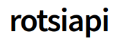

# ROTSI API Node.js SDK

[](https://www.npmjs.com/package/rotsiapi)

> The wrapper provides convenient access to the ROTSI API from applications written for Node.js.

## Install

You can install the package from [npm](https://www.npmjs.com/package/rotsiapi) by running: 

```bash
$ npm i rotsiapi
```

## Usage

The package needs to be configured with your app username and secret_key, which you can get from the [dashboard](https://dashboard.rotsi.co.ke/)


```javascript
// Import the npm package
const Rotsi = require('rotsiapi'); 

const username = 'xxxxxxxx';
const secretKey = 'xxxxxxxxxxxxxxxxxxxxxxx';

// Set additional options if needed
const credentials = {
    secretKey: username,
    username: secretKey,
};
const rotsiInstance = Rotsi(credentials);
const stkParams = {
    amount: 1,
    phone: '254711222333', 
};
rotsiInstance.STK.initiateSTK(stkParams)
    .then(response => {
        console.log('STK initiated successfully:', response);
    })
    .catch(error => {
        console.error('Error initiating STK: ', error.response ? error.response.data : error.message);
    });
```

## Initialization

Initialize the SDK as a requirement by doing `require('rotsiapi')(credentials)`. After initialization, you can get instances of offered services as follows:

- [SMS Service](#stk) : `Rotsi.STK`

- [KRA REMIT TAX Service](#airtime) : `Rotsi.KRA`

- [B2C Service](#mobiledata) : `Rotsi.B2C`

- [SINGLE INVOICE Service](#voice) : `Rotsi.SINGLEINVOICE`

- [BUYGOODS Service](#token) : `Rotsi.BUYGOODS`

- [PAYBILL Service](#application) : `Rotsi.PAYBILL`

- [CANCEL SINGLE INVOICE Service](#application) : `Rotsi.CANCELSINGLEINVOICE`

## Development

Run all tests:

```bash
$ npm install
$ npm test
```

or on Windows...

```bash
$ npm install
$ npm run test-windows
```


## Issues

If you find a bug, please file an issue on [our issue tracker on GitHub](https://github.com/RotsiApiLtd/rotsiapi-node.js-/issues).
